# SOC Honeypot Lab

A fully automated threat detection and response pipeline hosted on AWS. 
Real SSH honeypots catch live attacks from across the internet, feed them 
into a SIEM, enrich attacker IPs with threat intelligence, and automatically 
block them — all without human intervention.

Built as a portfolio project to demonstrate practical SOC, cloud, and 
detection engineering skills using real-world attack data.

---

## Architecture

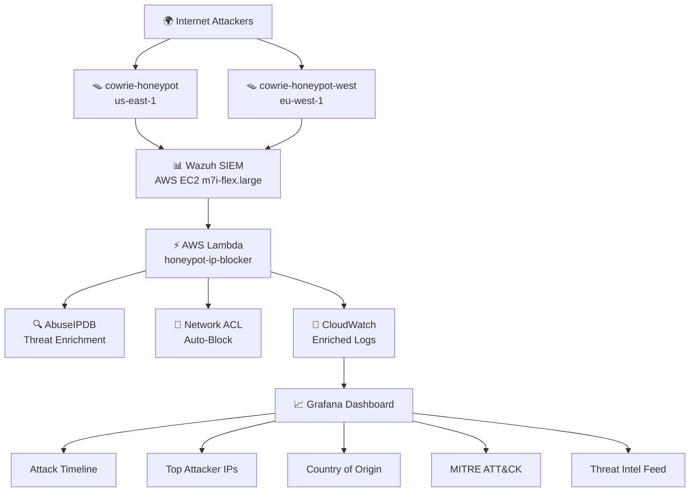

## Stack

| Component | Technology |
|---|---|
| Honeypot | Cowrie 3.0 (SSH/Telnet) |
| SIEM | Wazuh 4.11.2 + OpenSearch |
| Visualization | Grafana |
| Auto-response | AWS Lambda (Python) |
| Threat Intel | AbuseIPDB API |
| Network blocking | AWS Network ACL |
| Infrastructure | AWS EC2, VPC, IAM, CloudWatch |

---

## Features

- **Dual-sensor deployment** across two AWS regions (us-east-1, eu-west-1) for geographic attack correlation
- **Real-time threat enrichment** — every attacker IP automatically scored against AbuseIPDB, returning country, ISP, abuse confidence score, and prior report count
- **Automated IP blocking** — Lambda fires on every Wazuh alert and adds attacker IP to a Network ACL deny list within seconds
- **Custom Wazuh detection rules** mapped to MITRE ATT&CK framework
- **Cross-sensor attacker attribution** via HASSH SSH client fingerprinting
- **Full attack chain logging** — credentials attempted, commands executed, malware download attempts, C2 communication

---

## Dashboard

### All-time view
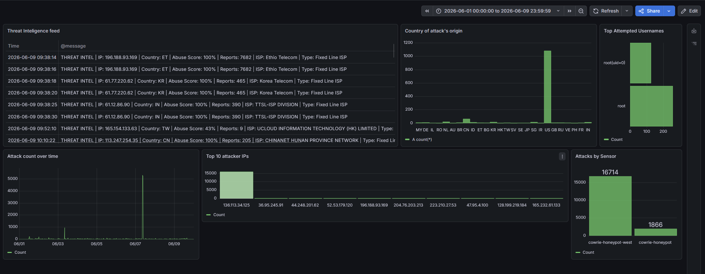

### Last 2 days
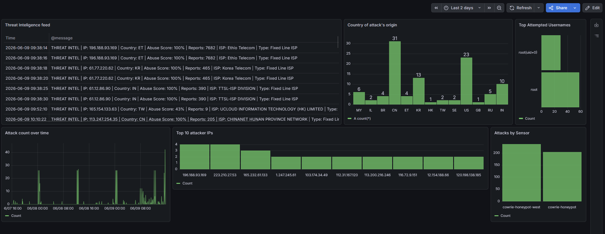

### West sensor — last 2 days
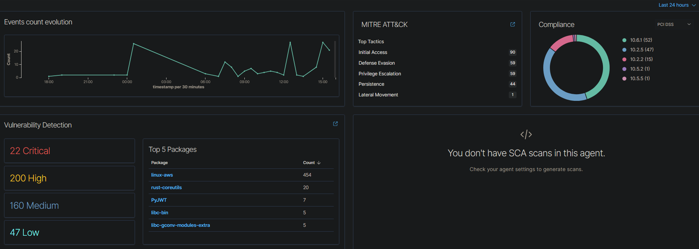

### Threat Intelligence Feed
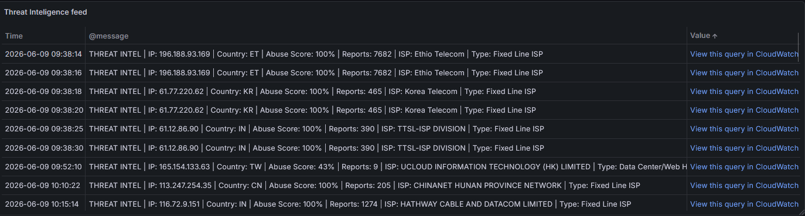

### Country of Attack Origin
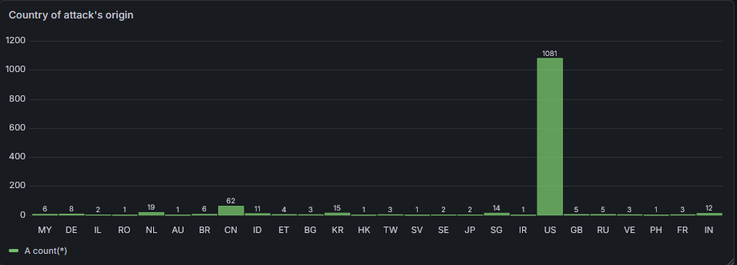

### Attacks by Sensor
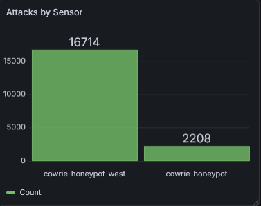

---

## Infrastructure

### EC2 Instances running
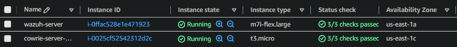

### Lambda function
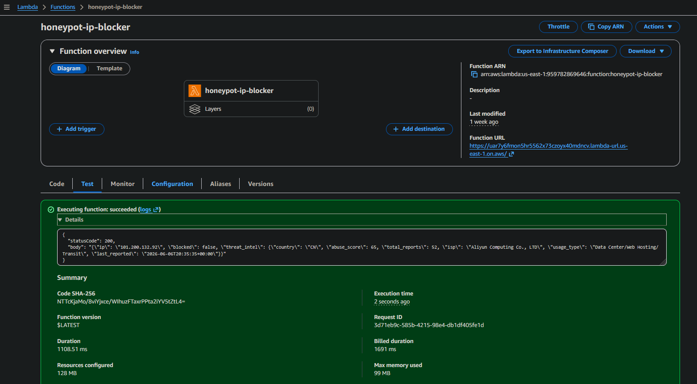

### Network ACL blocklist
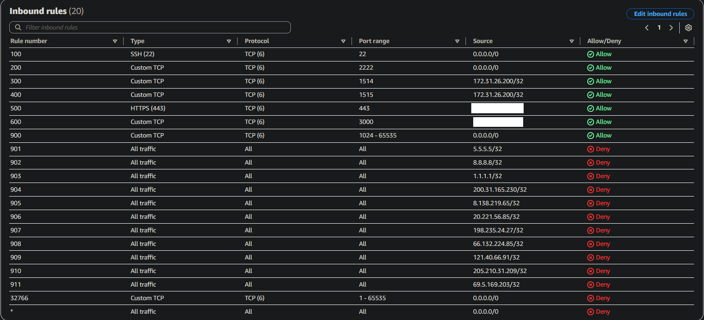

---

## Threat Analysis Reports

eal attack investigations conducted using data collected by this lab:

### [1. Credential Stuffing Campaign — El Salvador (2026-06-01)](threat-analysis-200.31.165.230.md)
Automated botnet from a compromised Salvadoran ISP machine cycling through 
300+ passwords against the root account at 3 attempts/second. HASSH fingerprint 
`01ca35584ad5a1b66cf6a9846b5b2821` identified as a key IOC.

### [2. Large-Scale GCP Credential Flood — United States (2026-06-07)](threat-analysis-136.113.34.125.md)
63,672 events in a single hour from a Google Cloud instance — 17 connections 
per second sustained for 60 minutes. **HASSH fingerprint matched the June 1st 
El Salvador campaign**, linking both attacks to the same malware kit or operator 
despite different source countries and a 6-day gap. Cross-sensor attribution 
via HASSH demonstrated.

### [3. Malware Deployment Attempt — China/Alibaba Cloud (2026-06-03)](threat-analysis-101.200.132.92.md)
Most technically sophisticated attack observed. Post-authentication malware 
staging using a 3-fallback downloader (curl → wget → raw TCP), UPX-packed 
binary, base64-encoded C2 config, and a clean C2 server on Alibaba Cloud HK 
suggesting deliberate infrastructure rotation. Consistent with XMRig 
cryptominer or Mirai botnet deployment.

**MITRE ATT&CK techniques observed across all campaigns:**

| ID | Technique |
|---|---|
| T1110.001 | Brute Force: Password Guessing |
| T1078 | Valid Accounts |
| T1059.004 | Unix Shell |
| T1082 | System Information Discovery |
| T1105 | Ingress Tool Transfer |
| T1027 | Obfuscated Files or Information |
| T1583.006 | Acquire Infrastructure: Web Services |
| T1036 | Masquerading |
| T1496 | Resource Hijacking (intended) |

---

## Key Stats (first 2 weeks live)

| Metric | Value |
|---|---|
| Total attack events | 18,000+ |
| Unique attacker IPs | 50+ |
| Countries of origin | 15+ |
| Malware deployment attempts | 1 confirmed |
| IPs auto-blocked | 20+ |
| Sensors | 2 (us-east-1, eu-west-1) |

---

## First Dashboard (Day 1)
The project on its first day vs after two weeks of live data:

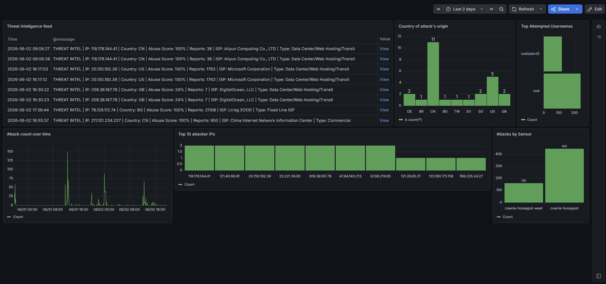

---

## Author
**Hubert Miecznikowski**  
[github.com/MiecznikH](https://github.com/MiecznikH)  
CompTIA Security+ | Cisco CCNA | AWS Solutions Architect Associate | Google IT Support Specialist
