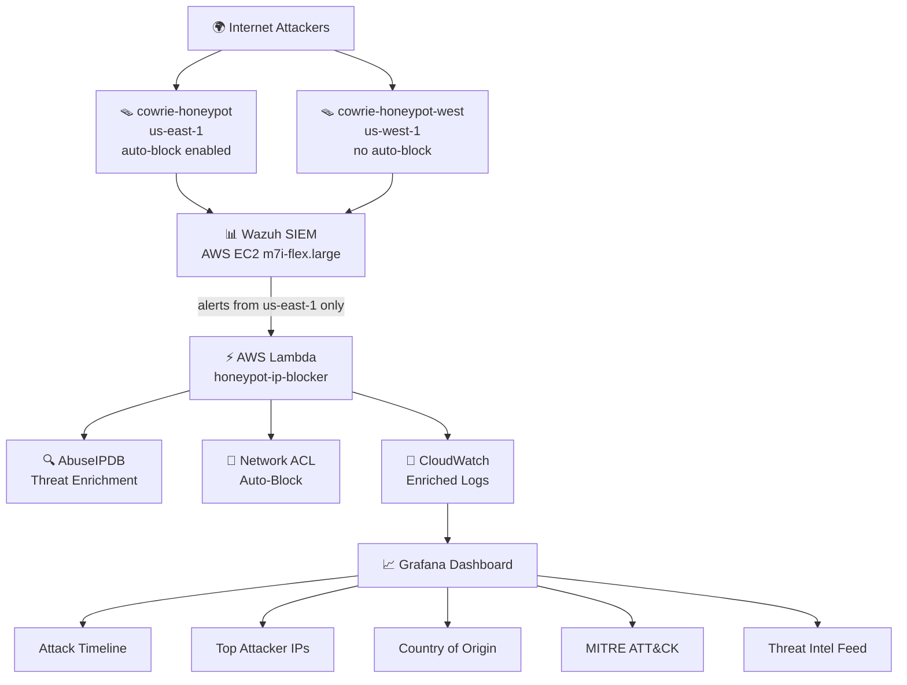

# SOC Honeypot Lab

Cowrie SSH honeypots across two AWS regions feeding a self-hosted Wazuh SIEM, with automated response and Grafana dashboards.

Everything below is written from traffic these sensors captured. Each analysis starts from raw session telemetry and ends with a defensive conclusion.

---

## Analyses

**[Linux/IoT botnet loader with a `/dev/tcp` telemetry gap](analyses/threat-analysis-43.100.32.28.md)**
A fully automated compromise attempt delivering a ~3.8 MB UPX-packed binary from a hardcoded C2. The loader falls back through `curl` → `wget` → a raw Bash `/dev/tcp` socket, guaranteeing delivery on minimal systems. The third path evades Cowrie's file-capture hooks entirely, so the payload was requested but never written to disk. **The blind spot is in the telemetry source, not the detection rule** — which changes where you fix it. Assessed Mirai/Gafgyt on behaviour, medium confidence; binary not recovered.

**[Credential stuffing from Google Cloud, correlated by HASSH](analyses/threat-analysis-136.113.34.125.md)**
7,958 credential attempts in roughly an hour. The client presented HASSH `01ca35584ad5a1b66cf6a9846b5b2821` — identical to a campaign six days earlier from a different country and a different sensor. Source addresses rotated; the client fingerprint did not. Cross-sensor, cross-campaign attribution from a single field.

**[Malware deployment attempt from Alibaba Cloud](analyses/threat-analysis-101.200.132.92.md)**
Post-exploitation staging traced end to end: architecture fingerprinting via `cat /bin/echo`, a benign-looking `echo 1 > /dev/null` prefix used as sandbox-evasion cover, then the multi-fallback download chain detached with `nohup`. Same incident as the loader analysis above, read from the intrusion side rather than the payload side — one compromise, two vantage points, not two campaigns.

**[Silent credential harvester](analyses/threat-analysis-118.178.144.41.md)**
One successful login, zero commands, immediate disconnect. A validation pass rather than an intrusion — the credentials are banked for a later wave. Documented alongside the noisy campaigns because the absence of post-exploitation activity is itself the signature.

**[Credential stuffing campaign, El Salvador](analyses/threat-analysis-200.31.165.230.md)**
300+ attempts in three minutes, a new TCP connection per credential pair to defeat session-based lockout. Wordlist traced to breach-compilation material of the MySpace/Facebook era.

---

## Architecture


```mermaid
flowchart TD
    A[🌍 Internet Attackers] --> B
    A --> C

    B[🪤 cowrie-honeypot<br/>us-east-1<br/>auto-block enabled]
    C[🪤 cowrie-honeypot-west<br/>us-west-1<br/>no auto-block]

    B --> D[📊 Wazuh SIEM<br/>AWS EC2 m7i-flex.large]
    C --> D

    D -->|alerts from us-east-1 only| E[⚡ AWS Lambda<br/>honeypot-ip-blocker]

    E --> F[🔍 AbuseIPDB<br/>Threat Enrichment]
    E --> G[🚫 Network ACL<br/>Auto-Block]
    E --> H[📝 CloudWatch<br/>Enriched Logs]

    H --> I[📈 Grafana Dashboard]

    I --> J[Attack Timeline]
    I --> K[Top Attacker IPs]
    I --> L[Country of Origin]
    I --> M[MITRE ATT&CK]
    I --> N[Threat Intel Feed]
```

- **Sensors** — Cowrie on EC2 in two regions. Real admin SSH is moved to a non-standard port and 22 is redirected to Cowrie via `iptables`, so the decoy owns the port attackers actually target.
- **SIEM** — Wazuh 4.11.2 (manager, indexer, dashboard), agent version pinned and held with `apt-mark hold`.
- **Log pipeline** — the Wazuh agent tails `cowrie.json` as JSON, configured at bootstrap. Without that `<localfile>` block the SIEM stays green while receiving nothing of value.
- **Automated response** — Lambda enriching source addresses against AbuseIPDB and pushing NACL denies, wired to the us-east-1 sensor only. us-west-1 runs unprotected, which is why the high-volume campaigns below all landed there: they ended when the attacker ran out of wordlist, not when a block fired. Evidence in [`screenshots/`](screenshots/).
- **Infrastructure** — Terraform in [`terraform/`](terraform/), full bootstrap in [`templates/honeypot_userdata.sh.tpl`](terraform/templates/honeypot_userdata.sh.tpl).

---

## Detections

Sigma rules in [`detections/`](detections/), mapped to MITRE ATT&CK:

| Rule | Technique | Covers | Level |
|---|---|---|---|
| [File Transfer to Cowrie SSH Honeypot](detections/cowrie_file_transfer_to_honeypot.yml) | [T1105](https://attack.mitre.org/techniques/T1105/) — Ingress Tool Transfer | `curl` / `wget` downloads, SCP/SFTP pushes | high |
| [Bash `/dev/tcp` Socket Used for File Transfer](detections/cowrie_dev_tcp_socket_transfer.yml) | [T1105](https://attack.mitre.org/techniques/T1105/) — Ingress Tool Transfer, [T1059.004](https://attack.mitre.org/techniques/T1059/004/) — Unix Shell | raw socket fallback, no file event produced | high |

Both log sources are `cowrie` / `ssh`, but they read different telemetry, and that split is the point. The first rule matches file events, which Cowrie only emits for transfers it instruments. The loader analysed above defeated exactly that by falling back to a raw Bash socket — requested its payload, and nothing was ever written to the download store. The second rule matches command input instead, which still records the attempt. Neither rule covers the other's path; deployed together they cover the whole fallback chain.

---

## Post-mortem

Two failures are recorded here rather than hidden, because the failure modes carry more transferable lesson than the happy path.

**Restart cascade.** After a full stop/start, public addresses changed and the agent lost its manager; the Grafana Elasticsearch plugin was killed by its own auto-updater writing into a read-only bundled directory; and the agent was shipping `journald` but not `cowrie.json`, so the SIEM was healthy and empty at the same time.

*Fixes:* Elastic IP on the manager so the agent's target never moves, Wazuh agent version pinned and held, Cowrie pinned to a git ref, and the honeypot rebuilt in Terraform so it is reproducible instead of hand-tuned.

**Bootstrap halted mid-run.** A rebuilt instance came up healthy, accepted SSH, and had never registered its agent — it did not appear on the manager at all. The bootstrap is fail-fast, so it stopped at its first error and everything downstream silently did not happen. An instance that looks healthy and is not is the more dangerous outcome, which is why the script tees its full output to `/var/log/user-data.log`.

---

## Repository layout

```
analyses/     threat analyses, named by attacker or C2 address
detections/   Sigma rules mapped to MITRE ATT&CK
terraform/    infrastructure as code and bootstrap template
screenshots/  dashboards, sensor breakdowns, Lambda and NACL evidence
```

## Roadmap

- Out-of-band packet capture triggered on the `/dev/tcp/` alert, to recover the payload from the wire that Cowrie's file capture cannot store
- Attack range: a Linux endpoint reporting to the existing Wazuh manager for running attack simulations and tuning detections against them, then Windows and Active Directory
- ATT&CK coverage matrix across all rules

## Related labs

- Windows LOLBin Detection Lab
- Linux Security Monitoring Lab
